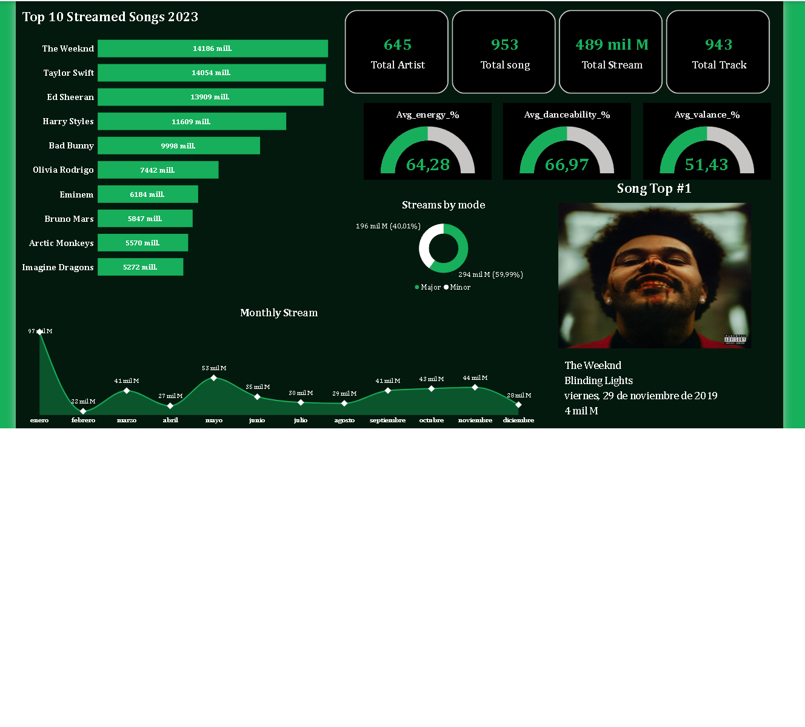

# 🎵 Spotify Songs — Power BI Dashboard

## 📊 Project Overview

This project presents an interactive Power BI dashboard developed to explore and analyze a dataset of Spotify songs.

The objective is to transform raw music data into clear visual insights that help identify patterns in song characteristics, popularity, genres, and other relevant audio metrics.

## 🎯 Objectives

* Explore and understand the Spotify songs dataset.
* Clean and transform the data using Power Query.
* Build a structured data model for analysis.
* Create calculated measures using DAX.
* Develop interactive KPIs and visualizations.
* Identify relevant patterns and trends in the dataset.
* Present the analysis through an interactive Power BI dashboard.

## 🛠️ Tools & Technologies

* **Power BI**
* **Power Query**
* **DAX**
* **Data Modeling**
* **Data Visualization**
* **Git / GitHub**

## 📈 Dashboard

The dashboard includes visualizations and KPIs designed to facilitate the exploration of Spotify song data.

### Dashboard Preview



## 🔄 Data Preparation

The project follows a basic data analytics workflow:

**Raw Data → Data Cleaning → Transformation → Data Modeling → DAX Measures → Visualization → Insights**

Data preparation includes activities such as:

* Data type validation
* Data cleaning
* Handling missing or inconsistent values
* Data transformation
* Data modeling
* Creation of calculated measures

## 📌 Key Skills Demonstrated

* Data cleaning and preparation
* Data transformation with Power Query
* Data modeling
* DAX calculations
* KPI development
* Interactive dashboard design
* Data visualization
* Analytical thinking
* Git and GitHub project management

## 📁 Project Structure

```text
Dashboard_Spotify_songs/
│
├── Dashboard_Spotify_songs.pbip
├── Dashboard_Spotify_songs.Report/
├── Dashboard_Spotify_songs.SemanticModel/
├── README.md
└── images/
    └── dashboard_spotify.png
```

## 📚 Data Source

Spotify songs dataset used for educational and portfolio analysis purposes.

The original data file is not included in this repository.

## 👩‍💻 Author

**Adriana Elizabeth Gómez**

Junior Data Analyst focused on data analysis, visualization, SQL, Python, Excel and Power BI.
